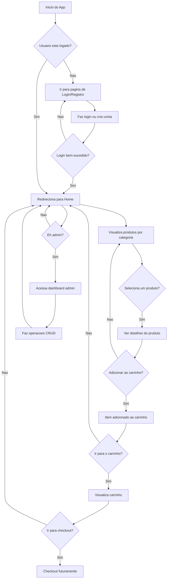

## Fluxograma

```mermaid
flowchart TD
    A[Inicio do App] --> B{Usuario esta logado?}
    B -- Nao --> C[Ir para pagina de Login/Registro]
    C --> D[Faz login ou cria conta]
    D --> E{Login bem-sucedido?}
    E -- Nao --> C
    E -- Sim --> F[Redireciona para Home]

    B -- Sim --> F[Redireciona para Home]

    F --> G[Visualiza produtos por categoria]
    G --> H{Seleciona um produto?}
    H -- Sim --> I[Ver detalhes do produto]
    I --> J{Adicionar ao carrinho?}
    J -- Sim --> K[Item adicionado ao carrinho]
    J -- Nao --> G

    K --> L{Ir para o carrinho?}
    L -- Sim --> M[Visualiza carrinho]
    M --> N{Ir para checkout?}
    N -- Sim --> O[Checkout futuramente]
    N -- Nao --> F

    L -- Nao --> F

    F --> P{Eh admin?}
    P -- Sim --> Q[Acessa dashboard admin]
    Q --> R[Faz operacoes CRUD]
    R --> F

    P -- Nao --> F


```
