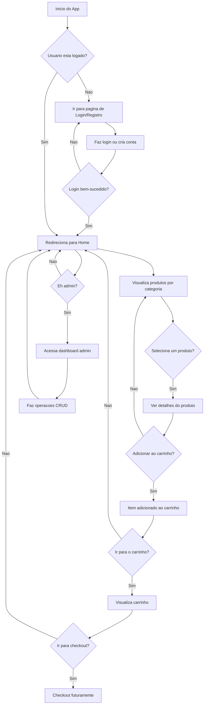

# Loja Virtual com React, Zustand e Vite

Este é um projeto de loja virtual de teste, desenvolvido com o objetivo de consumir uma API https://api.escuelajs.co/docs e demonstrar meu conhecimento técnico nas ferramentas e tecnologias solicitadas no teste.

---

## **Índice**
- [Loja Virtual com React, Zustand e Vite](#loja-virtual-com-react-zustand-e-vite)
  - [**Índice**](#índice)
  - [**Sobre o Projeto**](#sobre-o-projeto)
  - [**Funcionalidades**](#funcionalidades)
  - [**Tecnologias Utilizadas**](#tecnologias-utilizadas)
  - [**Pré-requisitos**](#pré-requisitos)
  - [**Instalação**](#instalação)
  - [**Como Rodar**](#como-rodar)
    - [Ambiente de Desenvolvimento:](#ambiente-de-desenvolvimento)
    - [Build para Produção:](#build-para-produção)
  - [**Testes**](#testes)
    - [Testes Unitários:](#testes-unitários)
    - [Testes E2E:](#testes-e2e)
  - [**Estrutura de Pastas**](#estrutura-de-pastas)
  - [Fluxograma](#fluxograma)

---

## **Sobre o Projeto**

Este projeto simula uma loja virtual que inclui navegação por categorias, exibição de produtos e um carrinho de compras. Ele é ideal para desenvolvedores que desejam aprender sobre gerenciamento de estado com Zustand, criação de componentes reutilizáveis e configuração de projetos modernos com Vite.

---

## **Funcionalidades**

- **Página Inicial (Home):**
  - Campo de busca funcional.
  - Menu dinâmico de categorias.
  - Banner slider com imagens.
  - Produtos em destaque.

- **Página de Categorias:**
  - Listagem de produtos filtrados por categorias.
  - Filtros dinâmicos.

- **Página de Detalhes do Produto:**
  - Exibição de detalhes do produto, incluindo imagem, preço e descrição.
  - Botão de "Adicionar ao Carrinho" funcional.

- **Carrinho:**
  - Visualização da quantidade de itens adicionados.
  - Persistência dos itens no estado global.

- **Favoritos:**
  - Gerencie uma lista de produtos favoritos.

---

## **Tecnologias Utilizadas**

- **Front-end:**
  - React
  - Zustand (Gerenciamento de estado)
  - React Router Dom

- **Ferramentas e Configurações:**
  - Vite (para build e desenvolvimento)
  - Cypress (Testes E2E)
  - Jest + React Testing Library (Testes unitários)

---

## **Pré-requisitos**

- Node.js (versão 16 ou superior)
- NPM ou Yarn

---

## **Instalação**

1. Clone o repositório:
   ```bash
   git clone https://github.com/seu-repositorio/loja-virtual.git
   ```

2. Acesse a pasta do projeto:
   ```bash
   cd loja-virtual
   ```

3. Instale as dependências:
   ```bash
   npm install
   ```

---

## **Como Rodar**

### Ambiente de Desenvolvimento:
1. Inicie o servidor de desenvolvimento:
   ```bash
   npm run dev
   ```

2. Acesse no navegador:
   ```
   http://localhost:5173
   ```

### Build para Produção:
1. Crie o build do projeto:
   ```bash
   npm run build
   ```

2. Sirva os arquivos estáticos:
   ```bash
   npm run preview
   ```

---

## **Testes**

### Testes Unitários:
- Utilize o Jest:
  ```bash
  npm test
  ```

### Testes E2E:
- Com Cypress:
  ```bash
  npx cypress open
  ```

---

## **Estrutura de Pastas**

```bash
src/
├── api/              # Serviços para comunicação com APIs
├── assets/           # Arquivos estáticos (imagens, fontes, etc.)
├── components/       # Componentes reutilizáveis
├── hooks/            # Hooks customizados
├── pages/            # Páginas principais (Home, Categoria, Produto)
├── routes/           # Configuração de rotas
├── store/            # Configuração do Zustand
├── styles/           # Estilos globais e temas
├── types/            # Definições de tipos TypeScript
├── utils/            # Funções utilitárias
├── index.css         # Estilos globais
├── main.tsx          # Arquivo principal do React
└── vite-env.d.ts     # Definições de ambiente para o Vite

public/               # Arquivos públicos
cypress/              # Testes E2E com Cypress
```

---

## Fluxograma


